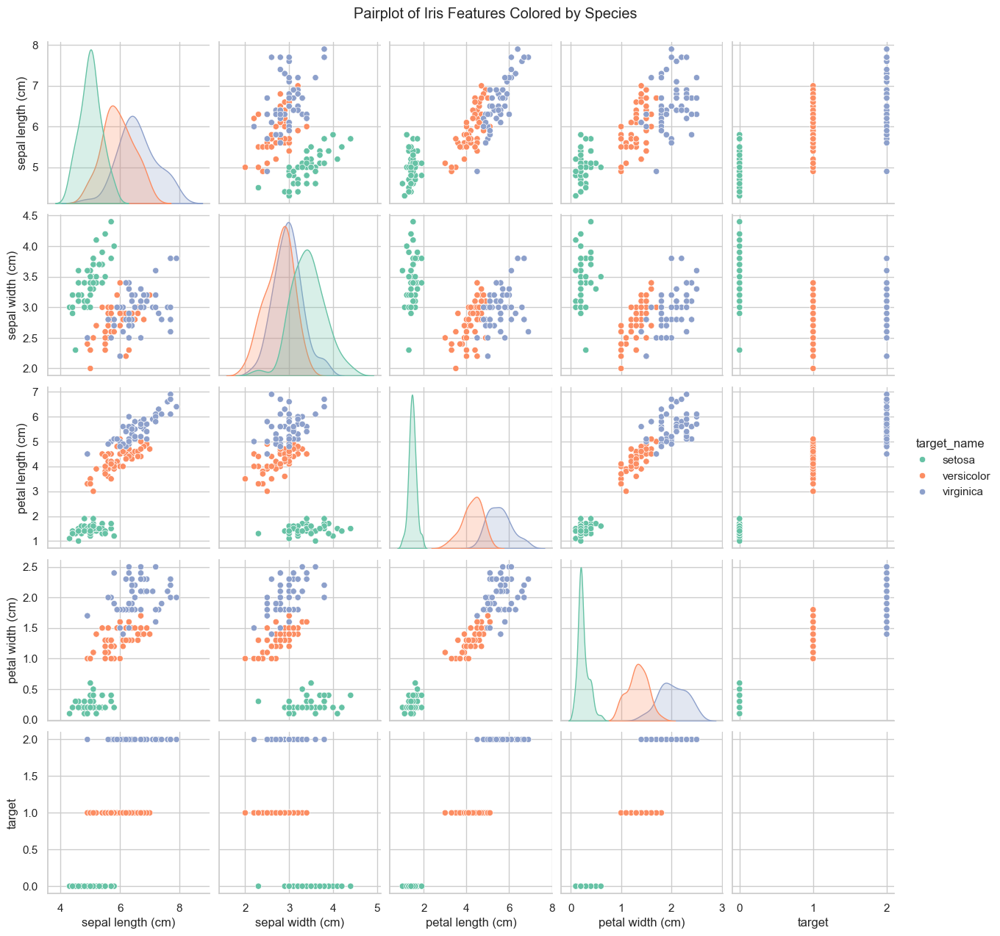

# Introduction 
The following is my first project on machine learning. I utilised several videos online to learn the intracacies of machine learning. I am excited to learn more as I progress into my data science career. 

## Iris Dataset 
For this project I utilised the iris dataset which is found within the scikit-learn module. This dataset contains length and width for various Iris flower species and is the perfect introduction to machine learning 

## Findings 
I first set a target and used a training and test model. I checked several parameters and assessed the differences between my models through graphs 
#### Code 
``` python 
sns.pairplot(iris_2, hue = "target_name", palette='Set2')
plt.suptitle('Pairplot of Iris Features Colored by Species', y=1.02)
plt.show()
```
#### Visualisation
 

- The pairplot provided me with a wide view of what to test, specifically, looking at how close the model can get to guessing the right species based on sepal length and width (cm)

## Utilising manual methods 
Following the graph, I then utilised a manual method to test the accuracy of the model. I did it using the following code: 

#### Code 
``` python 
def single_feature_function(petal_length):
    if petal_length < 2.5:
        return 0  # Setosa
    elif petal_length < 4.8:
        return 1  # Versicolor
    else:
        return 2  # Virginica                                        

manual_y_prediction = np.array([single_feature_function(val) for val in X_train[:, 2]])

np.mean(manual_y_prediction == y_train)

```
- This code gave me 96% accuracy which is very good for a manual model just through a function. It goes to show the power of functions in python. Despite this, I wanted to go further and see if I could improve this!

## Using Logistic Regression Models 
Now I wanted to test the accuracy of a machine learning model. I utilised logistic regression as per the instructions, however, I am sure there are other models that can also be applied. Logistic regression is a statistical and machine learning algorithm used to predict a categorical outcome, such as "yes" or "no," by modeling the probability of an event occurring (Google).

#### Code 
``` python 
Xt, Xv, yt, yv = train_test_split(X_train, y_train, test_size=0.25)
model.fit(Xt, yt)
y_pred = model.predict(Xv)

np.mean(y_pred == yv)
```
- Using logistic regression I achieved 100% accuracy. Whilst this is great I am skeptical about this result. It is likely as I develop more I will begin to understand how and why this result came about!

## Cross validating 
I then wanted to cross-validate, looking at what the model would do with unseen data 

#### Code 
``` python 
accuracies = cross_val_score(model2, X_train, y_train, cv=5, scoring='accuracy')
np.mean(accuracies)
```
- By cross-validating, I achieved 97% accuracy which is pretty good!

## Misclassifications 
Out of curiousity I wanted to check what data points the model was getting wrong. 

``` python 

df_predictions = iris_train.copy()
df_predictions["correctly_predicted"] = predicted_correctly_mask
df_predictions.head(10)

def plot_incorrect_predictions(df, x_axis_feature, y_axis_feature):
    fig, ax = plt.subplots(2,2, figsize=(10,10))
    ax = ax.flatten()
    sns.scatterplot(data=df, x=x_axis_feature, y=y_axis_feature, hue="prediction_label", palette='Set1', ax=ax[0])
    sns.scatterplot(data=df, x=x_axis_feature, y=y_axis_feature, hue="target_name", palette='Set1', ax=ax[1])
    sns.scatterplot(data=df, x=x_axis_feature, y=y_axis_feature, hue="correctly_predicted", palette='Set1', ax=ax[2])
    ax[3].set_visible(False)

plot_incorrect_predictions(df_predictions, "petal length (cm)", "petal width (cm)")    
```

- As shown the model got wrong two figures of virginica and versicolor that was extremely close to one another. It can be forgiven! 

## Model Tuning 
Now I wanted to see how close I could get this model by fiddling with the parameters. I tested various levels, as shown in the code below: 

#### Code 
``` python 
from sklearn.ensemble import RandomForestClassifier

model_3 = RandomForestClassifier()

accs = cross_val_score(model_3, X_train, y_train, cv=5, scoring='accuracy')
np.mean(accs)

for reg_pram in [0.01, 0.1, 0.3, 0.75, 0.9, 1.0, 1.3, 1.9, 2.0, 2.3, 2.5, 2.6, 2.9, 3.0]:
    print(reg_pram)
    model_4 = LogisticRegression(max_iter=200, C=0.75)
    acccs = cross_val_score(model_4, X_train, y_train, cv=5, scoring='accuracy')
    print(f"Accuracy: {np.mean(acccs) * 100:.2f}%")
```
- The closest I got was 97%, which is good but I am not sure how this works and as such will need to learn more about this to correctly measure the result!

## Modelling on Test Set
I wanted to finish off by testing on the model set. The results were as follows: 

#### Code 
``` python 
model.fit(X_train, y_train)

y_pred_test = model.predict(X_test)

testset_correctly_classified = y_pred_test == y_test
testset_accuracy = np.mean(testset_correctly_classified)

print(f"Test Set Accuracy: {testset_accuracy * 100:.2f}%")
```
- The results were 94%, pretty good! 

# Conclusion 
In conclusion I created a model that accurately predicted iris flower species based on sepal and flower length and width. I utilised videos to learn about this dataset and hope to keep improving my skills to create my own machine learning models. 